# Tatum integration — complete A-to-Z guide

**Repository:** `terescrow--backend`  
**Last aligned with code:** May 2026

This document explains **every Tatum-related flow** in this codebase: wallet creation (master + per-user), deposit addresses, webhooks, ledger credits, customer **external send**, and admin treasury moves. It lists **all supported crypto assets**, **which chains each feature uses**, and **every source file** you need to read or change.

> **ACH / fiat banking:** This backend does **not** use Tatum for ACH or bank rails. Fiat (NGN top-up, PalmPay, fiat wallets) lives in separate modules (`fiatWalletService`, PalmPay routes). Tatum is **crypto-only** here.

---

## Table of contents

1. [Architecture at a glance](#1-architecture-at-a-glance)
2. [Supported currencies (`wallet_currencies`)](#2-supported-currencies-wallet_currencies)
3. [Capability matrix by chain](#3-capability-matrix-by-chain)
4. [Three wallet layers](#4-three-wallet-layers)
5. [Environment variables](#5-environment-variables)
6. [Database models](#6-database-models)
7. [Flow A — User onboarding (virtual accounts + deposits)](#7-flow-a--user-onboarding-virtual-accounts--deposits)
8. [Flow B — Inbound deposit (webhook → ledger)](#8-flow-b--inbound-deposit-webhook--ledger)
9. [Flow C — Customer external send (master wallet signs)](#9-flow-c--customer-external-send-master-wallet-signs)
10. [Flow D — Admin disbursement & sweep (deposit key signs)](#10-flow-d--admin-disbursement--sweep-deposit-key-signs)
11. [HTTP APIs (routes)](#11-http-apis-routes)
12. [Tatum API catalog (v3 & v4)](#12-tatum-api-catalog-v3--v4)
13. [Complete codebase file index](#13-complete-codebase-file-index)
14. [Setup & operations checklist](#14-setup--operations-checklist)
15. [Related documentation](#15-related-documentation)

---

## 1. Architecture at a glance

The app uses **custodial bookkeeping in PostgreSQL** plus **Tatum as blockchain infrastructure** (wallet generation, broadcast, balances, address webhooks). It does **not** rely on Tatum Ledger virtual accounts for user balances in the main flow.

| Layer | What it is | Source of truth |
|-------|------------|-----------------|
| **Virtual account** | Per-user per-`wallet_currency` row with string balances | Your DB (`virtual_accounts`) |
| **User wallet** | One HD wallet (or Solana/XRP keypair) per user per chain | Your DB (`user_wallets`), keys from Tatum |
| **Deposit address** | On-chain address where users receive crypto | Your DB (`deposit_addresses`) |
| **Master wallet** | Hot wallet per chain for customer sends | Your DB (`master_wallets`) |

```mermaid
flowchart TB
  subgraph onboard["Onboarding"]
    V[Email verified] --> Q[Bull queue: create-virtual-account]
    Q --> VA[virtualAccountService.createVirtualAccountsForUser]
    VA --> DA[depositAddressService.generateAndAssignToVirtualAccount]
    DA --> WH[Tatum v4: INCOMING_NATIVE_TX + INCOMING_FUNGIBLE_TX]
  end
  subgraph inbound["Deposit"]
    CH[User sends to deposit address] --> TW[POST /api/v2/webhooks/tatum]
    TW --> RAW[tatum_raw_webhooks]
    TW --> PJ[processBlockchainWebhook]
    PJ --> CR[Credit virtual_accounts + ReceivedAsset + CryptoReceive]
  end
  subgraph outbound_user["Customer send"]
    API[POST /api/v2/crypto/send] --> MW[Decrypt MasterWallet key]
    MW --> TAT[Tatum v3 broadcast]
    TAT --> DB[Debit virtual_accounts]
  end
  subgraph outbound_admin["Admin treasury"]
    AD[send-to-vendor / send-to-master-wallet] --> DEP[Decrypt DepositAddress key]
    DEP --> TAT2[Tatum v3 broadcast from deposit]
  end
```



**Key design choices**

- Balances users see in the app come from **`virtual_accounts`**, updated when Tatum webhooks confirm deposits and when sends/debits succeed.
- **Deposits** land on the **user deposit address** (derived from the user’s wallet).
- **Customer withdrawals to external addresses** broadcast from the **master wallet** (hot liquidity), not from the deposit address.
- **Admin** can move funds **from the deposit address** to a vendor or back to the master wallet (treasury sweep).

---

## 2. Supported currencies (`wallet_currencies`)

Seeded in `prisma/seed/wallet-currencies.seed.ts`. Admin can add rows in `wallet_currencies`; `createAllMasterWallets` uses **distinct `blockchain`** values from this table.

| ID | Currency | Blockchain (DB) | Type | Contract | Notes |
|----|----------|-----------------|------|----------|-------|
| 2 | BTC | `bitcoin` | Native | — | |
| 3 | ETH | `Ethereum` | Native | — | DB casing varies; code normalizes to `ethereum` |
| 4 | TRON | `tron` | Native | — | Ledger code `TRON` |
| 5 | USDT | `ethereum` | ERC-20 | `0xdAC17F958D2ee523a2206206994597C13D831ec7` | USDT ETH |
| 6 | USDT_TRON | `tron` | TRC-20 | `TR7NHqjeKQxGTCi8q8ZY4pL8otSzgjLj6t` | |
| 7 | SOL | `solana` | Native | — | Receive + admin disburse; **no** customer external send |
| 8 | LTC | `Litecoin` | Native | — | |
| 9 | BSC | `bsc` | Native* | — | `isToken: true` in seed (BNB on BSC) |
| 10 | USDT_BSC | `bsc` | BEP-20 | `0x55d398326f99059fF775485246999027B3197955` | |
| 11 | USDC | `ethereum` | ERC-20 | `0xA0b86991c6218b36c1d19D4a2e9Eb0cE3606eB48` | UI may hide BSC USDC via `virtualAccountService` filter |
| 14 | USDC_BSC | `bsc` | BEP-20 | `0x64544969ed7EBf5f083679233325356EbE738930` | |

**Distinct blockchains for master wallet creation:**  
`bitcoin`, `ethereum` (and `Ethereum`), `tron`, `solana`, `litecoin` (`Litecoin`), `bsc`

**Chains with code support but not in default seed:** `polygon`, `dogecoin`, `xrp` — used if you add `wallet_currencies` rows and create master wallets (see admin `create-all` swagger and `tatum.service` v4 chain map).

---

## 3. Capability matrix by chain

| Chain (normalized) | Deposits (webhook) | Customer external send | Admin vendor / master sweep |
|--------------------|--------------------|-------------------------|-----------------------------|
| `ethereum` | Yes (native + ERC-20) | Yes (ETH, USDT, USDC) | Yes (EVM) |
| `bsc` | Yes | Yes (BNB/BSC, USDT_BSC, USDC_BSC) | Yes (EVM) |
| `polygon` | Yes* | Yes* | Yes (EVM)* |
| `tron` | Yes | Yes (TRON, USDT_TRON) | Yes |
| `bitcoin` | Yes | Yes | Yes (BTC) |
| `litecoin` | Yes | Yes | Yes (LTC) |
| `dogecoin` | Yes* | Yes* | Yes (DOGE)* |
| `solana` | Yes | **No** (rejected in `crypto.send.helpers`) | Yes (SOL) |
| `xrp` | Yes* | **No** | Limited* |

\*Requires `wallet_currencies` + `MasterWallet` row for that chain.

**Address reuse:** All tokens on the same base chain share **one deposit address** per user (e.g. ETH + USDT + USDC on Ethereum). See `deposit.address.service.ts` → `normalizeBlockchain` / reuse logic.

---

## 4. Three wallet layers

### 4.1 Master wallet (hot / liquidity)

- **One row per `blockchain`** in `master_wallets`.
- Created via Tatum `createWallet` → address + key at **index 0** (HD) or direct keypair (Solana/XRP).
- Used for: **customer external send**, gas checks in preview, optional admin `POST /master-wallet/send`.
- **File:** `src/services/tatum/master.wallet.service.ts`

**HD chains:** bitcoin, ethereum, tron, bsc, polygon, litecoin, dogecoin, …  
**Non-HD:** solana (`privateKey`), xrp (`GET /v3/xrp/account` → `secret`)

### 4.2 User wallet (per user, per chain)

- **One mnemonic/keypair per (`userId`, `blockchain`)** in `user_wallets`.
- Created on first deposit address generation.
- **File:** `src/services/user/user.wallet.service.ts`

### 4.3 Deposit address (receive)

- Linked to a `virtual_account`; stores **encrypted private key** for admin sweeps.
- Derived from user wallet at **index 0** (same index as master for HD).
- Registers **Tatum v4** webhooks on first creation only (reuse skips duplicate subscriptions).
- **File:** `src/services/tatum/deposit.address.service.ts`

---

## 5. Environment variables

| Variable | Required | Purpose |
|----------|----------|---------|
| `TATUM_API_KEY` | Yes | Header `x-api-key` on all Tatum HTTP calls |
| `TATUM_BASE_URL` | No | Default `https://api.tatum.io/v3` |
| `TATUM_WEBHOOK_URL` | Yes (prod) | Public URL registered on v4 subscriptions |
| `BASE_URL` | Yes | Fallback webhook URL: `{BASE_URL}/api/v2/webhooks/tatum` |
| `ENCRYPTION_KEY` | Yes | **Exactly 32 characters** — AES-256-CBC for mnemonics/keys in DB |

Example:

```env
TATUM_API_KEY=your_key
TATUM_BASE_URL=https://api.tatum.io/v3
TATUM_WEBHOOK_URL=https://api.yourdomain.com/api/v2/webhooks/tatum
BASE_URL=https://api.yourdomain.com
ENCRYPTION_KEY=12345678901234567890123456789012
```

---

## 6. Database models

Defined in `prisma/schema.prisma` (Tatum-related):

| Model | Role |
|-------|------|
| `WalletCurrency` | Supported assets (`blockchain`, `currency`, `contractAddress`, `isToken`, …) |
| `MasterWallet` | Hot wallet per chain (`address`, encrypted `privateKey`, `mnemonic`, `xpub`) |
| `UserWallet` | Per-user chain wallet |
| `VirtualAccount` | User ledger (`accountBalance`, `availableBalance`, `accountId` UUID) |
| `DepositAddress` | Receive address + encrypted key |
| `TatumRawWebhook` | Raw webhook audit |
| `WebhookResponse` | Parsed webhook / claim rows |
| `ReceivedAsset` | Admin tracking of inbound funds |
| `ReceiveTransaction` | Receive pipeline |
| `CryptoTransaction` / `CryptoReceive` / `CryptoSend` | Product transaction records |

**Important:** `VirtualAccount.accountId` is a **local UUID**, not a Tatum Ledger account ID in the main flow.

---

## 7. Flow A — User onboarding (virtual accounts + deposits)

### Trigger

After **email verification** (Tier 1), `auth.controllers.ts` dispatches a Bull job:

```327:341:src/controllers/customer/auth.controllers.ts
        // Create Tatum virtual accounts (async, don't block verification)
        // Dispatch job to queue system
        const { queueManager } = await import('../../queue/queue.manager');
        await queueManager.addJob(
          'tatum',
          'create-virtual-account',
          { userId: updateUser.id },
          {
            attempts: 3, // Retry 3 times on failure
            backoff: {
              type: 'exponential',
              delay: 5000, // Start with 5 second delay
            },
          }
        );
```

### Worker

`src/queue/worker.ts` → processor `create-virtual-account` → `processCreateVirtualAccountJob`.

### Step 1 — Create virtual accounts (DB only)

`virtualAccountService.createVirtualAccountsForUser(userId)`:

1. Loads all rows from `wallet_currencies`.
2. For each currency, inserts `virtual_accounts` if missing (`accountId` = `randomUUID()`, balances `"0"`).
3. Does **not** call Tatum Ledger for account creation.

**File:** `src/services/tatum/virtual.account.service.ts`

### Step 2 — Deposit address + webhooks

For each virtual account, `depositAddressService.generateAndAssignToVirtualAccount(account.id)`:

1. If user already has an address on the same **normalized** chain → **reuse** address + encrypted key (new `deposit_addresses` row only).
2. Else `userWalletService.getOrCreateUserWallet(userId, chain)` → Tatum wallet.
3. Derive address/key (HD index `0` or Solana/XRP direct).
4. Store encrypted key in `deposit_addresses`.
5. Register Tatum **v4** subscriptions:
   - Always `INCOMING_NATIVE_TX`
   - `INCOMING_FUNGIBLE_TX` if any token exists on that chain in `wallet_currencies`

**File:** `src/services/tatum/deposit.address.service.ts` (webhook block ~lines 318–369)

### Run the worker

```bash
npm run queue:work:tatum
```

(Or your deployment’s equivalent Bull worker for queue name `tatum`.)

---

## 8. Flow B — Inbound deposit (webhook → ledger)

### Ingress

| Item | Value |
|------|--------|
| Route | `POST /api/v2/webhooks/tatum` |
| Router | `src/routes/webhooks/tatum.webhook.router.ts` |
| Controller | `src/controllers/webhooks/tatum.webhook.controller.ts` |

**Controller behavior:**

1. Insert `tatum_raw_webhooks` immediately.
2. Call `processBlockchainWebhook(body)` **without awaiting** (respond **200** fast).
3. Update raw row `processed` / `errorMessage` when done.

### Processor (`process.webhook.job.ts`)

High-level decision tree:

```text
1. If webhook address == any MasterWallet.address → IGNORE (reason: master_wallet)
2. If INCOMING_NATIVE_TX | INCOMING_FUNGIBLE_TX | ADDRESS_EVENT:
   a. Resolve deposit_addresses by address (to/address field)
   b. If fungible: match contractAddress → correct VirtualAccount / WalletCurrency
   c. Dedupe: existing CryptoTransaction RECEIVE with same txHash
   d. If from == master wallet → IGNORE
3. Credit virtual_accounts (accountBalance + availableBalance)
4. Create WebhookResponse, ReceivedAsset, ReceiveTransaction, CryptoReceive
5. Push notification to user
```

**Token matching:** EVM contracts compared case-insensitively (`canonicalEvmContract`); Tron base58 exact match. See `tokenContractMatches` in `process.webhook.job.ts`.

**File:** `src/jobs/tatum/process.webhook.job.ts`

### Sample webhook shape (fungible)

```json
{
  "subscriptionType": "INCOMING_FUNGIBLE_TX",
  "address": "0x742d35Cc6634C0532925a3b844Bc454e4438f44e",
  "txId": "0xabc...",
  "amount": "100.5",
  "contractAddress": "0xdac17f958d2ee523a2206206994597c13d831ec7",
  "counterAddress": "0x1111..."
}
```

---

## 9. Flow C — Customer external send (master wallet signs)

User sends crypto to an **external** `toAddress`. On-chain tx is signed with **master wallet**; user **virtual account** is debited after successful broadcast.

### APIs

| Step | Method | Path |
|------|--------|------|
| Preview | `POST` | `/api/v2/crypto/send/preview` |
| Execute | `POST` | `/api/v2/crypto/send` |

**Auth:** Bearer JWT (`authenticateUser`).  
**Docs:** `docs/CLIENT_CRYPTO_SEND_API.md`

### Request body

```json
{
  "amount": 10.5,
  "amountInUsd": true,
  "currency": "USDT",
  "blockchain": "ethereum",
  "toAddress": "0x742d35Cc6634C0532925a3b844Bc9e7595f0bEb"
}
```

- Default: `amount` is **USD** (converted via `wallet_currency.price`).
- `amountInUsd: false` → `amount` is in **crypto** units.

### Service flow (`crypto.send.service.ts`)

1. Normalize blockchain (`crypto.send.helpers` → `normalizeCustomerSendBlockchain`).
2. Reject unsupported chains (`assertCustomerSendChainSupported`) — e.g. **solana**, **xrp**.
3. Load user `virtual_accounts` + `wallet_currency`.
4. **Preview:** Check user book balance; read **master** on-chain balance + gas via Tatum (`getEvmNativeBalance`, Tron, UTXO helpers).
5. **Send:** `findMasterWalletForChain` → decrypt master key → `executeCustodialSendNonEthereum` / EVM paths in `crypto.send.chain.handlers.ts`.
6. Tatum v3 `POST /{chain}/transaction` (see chain services below).
7. DB transaction: create `CryptoTransaction` + `CryptoSend`, debit `virtual_accounts`.

**Files:**

- `src/services/crypto/crypto.send.service.ts`
- `src/services/crypto/crypto.send.chain.handlers.ts`
- `src/services/crypto/crypto.send.helpers.ts`
- `src/controllers/customer/crypto.send.controller.ts`
- `src/routes/cutomer/crypto.send.router.ts`

### Chain execution (Tatum v3)

| Chain | Tatum path | Service file |
|-------|------------|--------------|
| Ethereum | `/ethereum/transaction` | `evm.tatum.transaction.service.ts` |
| BSC | `/bsc/transaction` | same |
| Polygon | `/polygon/transaction` | same |
| Tron | `/tron/transaction` | `tron.tatum.service.ts` |
| Bitcoin / LTC / DOGE | `/{chain}/transaction` | `utxo.tatum.service.ts` |

**Gas (EVM):** `ethereum.gas.service.ts` uses Tatum **v4** `blockchainOperations/gas`.

---

## 10. Flow D — Admin disbursement & sweep (deposit key signs)

Moves **on-chain funds from the user’s deposit address** (not master wallet).

### Use cases

| Action | Signs with | Route (example) |
|--------|------------|-----------------|
| Pay vendor from received deposit | **DepositAddress** private key | `POST .../transaction-tracking/:txId/send-to-vendor` |
| Sweep deposit → master | **DepositAddress** private key | `POST .../transaction-tracking/:txId/send-to-master-wallet` |

**Orchestrator:** `src/services/admin/received.asset.disbursement.service.ts`  
**Chain handlers:**

- `received.asset.disbursement.evm.ts` — ETH, BSC, Polygon tokens/native
- `received.asset.disbursement.tron.ts`
- `received.asset.disbursement.btc.ts` / `.ltc.ts` / `.doge.ts`
- `received.asset.disbursement.sol.ts` — SOL (rent-aware partial sweep possible)

**Rules:**

- Full receive amount only (no partial vendor payout except SOL sweep semantics).
- One successful outbound disbursement per receive transaction.
- Validates vendor network vs blockchain.

**Frontend docs:** `docs/FRONTEND_TRANSACTION_TRACKING_AND_DISBURSEMENT.md`

---

## 11. HTTP APIs (routes)

### 11.1 Webhooks

| Method | Path | Handler |
|--------|------|---------|
| POST | `/api/v2/webhooks/tatum` | `tatumWebhookController` |

### 11.2 Admin — master wallet

Base: `/api/admin/master-wallet`  
**Router:** `src/routes/admin/master.wallet.router.ts`

| Method | Path | Purpose |
|--------|------|---------|
| POST | `/` | Create one master wallet (`blockchain`, `endpoint`) |
| GET | `/` | List all |
| POST | `/create-all` | Create for every distinct `wallet_currencies.blockchain` |
| POST | `/update-all` | Backfill missing address/key on existing rows |
| GET | `/balances` | Tatum on-chain balances per master |
| GET | `/balances/summary` | Admin summary (auth required) |
| GET | `/assets` | Asset breakdown (auth) |
| GET | `/transactions` | Master tx history (auth) |
| POST | `/send` | Admin send from master (auth) |
| POST | `/swap` | Admin swap from master (auth) |
| GET | `/deposit-address/:userId/:currency/:blockchain` | Lookup user deposit address |

**Detailed API shapes:** `docs/MASTER_WALLET_GENERATION_API.md`

> **Security:** Several master-wallet routes do **not** attach `authenticateAdmin` in the router; protect at gateway or add middleware in production.

**Public Dogecoin setup (optional):** `GET /api/public/dogecoin-master-wallet/setup` — `src/controllers/public/dogecoin.master.wallet.setup.controller.ts`

### 11.3 Customer — crypto send

Base: `/api/v2/crypto` (mounted in `src/index.ts`)

| Method | Path | Purpose |
|--------|------|---------|
| POST | `/send/preview` | Fee + balance preview |
| POST | `/send` | Execute external send |

### 11.4 Customer — assets (read)

Virtual accounts and deposit addresses (no Tatum call on read):

- `src/routes/cutomer/crypto.asset.router.ts` — balances, asset list, deposit address in responses
- `src/controllers/customer/virtual.account.controller.ts`

### 11.5 Admin — transaction tracking / disburse

- `src/routes/admin/transaction.tracking.router.ts` — send-to-vendor, send-to-master-wallet

---

## 12. Tatum API catalog (v3 & v4)

### v3 — `https://api.tatum.io/v3` (via `TATUM_BASE_URL`)

| Operation | Method | Path pattern | Used in |
|-----------|--------|--------------|---------|
| Create HD wallet | GET | `/{blockchain}/wallet` | `tatum.service.createWallet` |
| Create XRP account | GET | `/xrp/account` | XRP master/user wallet |
| Derive address | GET | `/{blockchain}/address/{xpub}/{index}` | deposit + master index 0 |
| Derive private key | POST | `/{blockchain}/wallet/priv` | `{ mnemonic, index }` |
| EVM broadcast | POST | `/ethereum/transaction`, `/bsc/transaction`, `/polygon/transaction` | send + disburse |
| Tron broadcast | POST | `/tron/transaction` | send + disburse |
| UTXO broadcast | POST | `/bitcoin/transaction`, `/litecoin/transaction`, `/dogecoin/transaction` | send + disburse |
| Solana broadcast | POST | `/solana/transaction` | disburse |
| EVM native balance | GET | `/{ethereum\|bsc\|polygon}/account/balance/{address}` | preview, admin |
| Tron account | GET | `/tron/account/{address}` | balances |
| UTXO balance | GET | `/{btc\|ltc\|doge}/address/balance/{address}` | preview |
| Solana balance | GET | `/solana/account/balance/{address}` | disburse |
| Token balances | GET | `/blockchain/token/address/{CHAIN}/{addr}`, `/bsc/erc20/balance/...` | balances |
| UTXO fee | GET | `/blockchain/fee/{TICKER}` | UTXO sends |
| Ledger (legacy) | POST | `/ledger/account` | **Not used** in main user onboarding |

### v4 — `https://api.tatum.io/v4`

| Operation | Method | Path | Used in |
|-----------|--------|------|---------|
| Address webhook | POST | `/subscription` | `registerAddressWebhookV4` |
| Gas estimate | POST | `/blockchainOperations/gas` | `ethereum.gas.service.ts` |

**v4 chain slugs** (`getTatumV4Chain` in `tatum.service.ts`):  
`ethereum-mainnet`, `bsc-mainnet`, `tron-mainnet`, `bitcoin-mainnet`, `litecoin-core-mainnet`, `doge-mainnet`, `solana-mainnet`, `polygon-mainnet`, `ripple-mainnet`, …

**Webhook types registered:**

- `INCOMING_NATIVE_TX` — native coin to watched address
- `INCOMING_FUNGIBLE_TX` — ERC-20 / TRC-20 / BEP-20 to watched address

---

## 13. Complete codebase file index

### Core Tatum services

| File | Responsibility |
|------|----------------|
| `src/services/tatum/tatum.service.ts` | HTTP client, `createWallet`, address/key derivation, v4 webhooks, balances |
| `src/services/tatum/master.wallet.service.ts` | Master wallet CRUD, `createAllMasterWallets`, encryption |
| `src/services/tatum/virtual.account.service.ts` | User virtual account rows (DB ledger) |
| `src/services/tatum/deposit.address.service.ts` | Deposit addresses, reuse, webhook registration |
| `src/services/user/user.wallet.service.ts` | Per-user per-chain wallet |
| `src/utils/tatum.logger.ts` | Structured Tatum logging |

### Chain-specific Tatum adapters

| File | Chains |
|------|--------|
| `src/services/tatum/evm.tatum.transaction.service.ts` | ethereum, bsc, polygon |
| `src/services/tatum/evm.tatum.balance.service.ts` | EVM balances |
| `src/services/ethereum/ethereum.gas.service.ts` | EVM gas (v4) |
| `src/services/ethereum/ethereum.transaction.service.ts` | Legacy/alternate EVM paths |
| `src/services/ethereum/ethereum.balance.service.ts` | EVM balance helpers |
| `src/services/tron/tron.tatum.service.ts` | TRX, TRC-20 |
| `src/services/utxo/utxo.tatum.service.ts` | BTC, LTC, DOGE |
| `src/services/bitcoin/bitcoin.tatum.service.ts` | BTC-specific helpers |
| `src/services/solana/solana.tatum.service.ts` | SOL transfers (disburse) |

### Jobs & webhooks

| File | Responsibility |
|------|----------------|
| `src/jobs/tatum/create.virtual.account.job.ts` | Onboarding queue job |
| `src/jobs/tatum/process.webhook.job.ts` | Deposit crediting |
| `src/jobs/tatum/retry.sell.token.transfer.job.ts` | Sell flow retries (uses Tatum) |
| `src/controllers/webhooks/tatum.webhook.controller.ts` | Webhook HTTP ingress |
| `src/routes/webhooks/tatum.webhook.router.ts` | Webhook route |

### Customer send

| File | Responsibility |
|------|----------------|
| `src/services/crypto/crypto.send.service.ts` | Preview + send orchestration |
| `src/services/crypto/crypto.send.chain.handlers.ts` | Master-signed Tatum broadcasts |
| `src/services/crypto/crypto.send.helpers.ts` | Chain normalization, validation |
| `src/services/crypto/crypto.unified.usdt.ts` | USDT multi-network balance helpers |
| `src/controllers/customer/crypto.send.controller.ts` | HTTP handlers |
| `src/routes/cutomer/crypto.send.router.ts` | Routes |

### Admin

| File | Responsibility |
|------|----------------|
| `src/controllers/admin/master.wallet.controller.ts` | Master wallet HTTP API |
| `src/routes/admin/master.wallet.router.ts` | Master wallet routes |
| `src/services/admin/master.wallet.admin.service.ts` | Balances, assets, send/swap |
| `src/services/admin/received.asset.disbursement.service.ts` | Vendor + master sweep orchestration |
| `src/services/admin/received.asset.disbursement.*.ts` | Per-chain disburse executors |
| `src/services/admin/received.asset.disbursement.helpers.ts` | Address validation, decrypt |
| `src/controllers/admin/transaction.tracking.controller.ts` | Disburse HTTP |
| `src/routes/admin/transaction.tracking.router.ts` | Disburse routes |

### Crypto product (uses Tatum indirectly)

| File | Notes |
|------|-------|
| `src/services/crypto/crypto.buy.service.ts` | Credits virtual account after fiat buy |
| `src/services/crypto/crypto.sell.service.ts` | Debits + on-chain from deposit |
| `src/services/crypto/crypto.transaction.service.ts` | Transaction records |
| `src/services/crypto/crypto.asset.service.ts` | Portfolio reads |

### Queue & app entry

| File | Notes |
|------|-------|
| `src/queue/worker.ts` | Registers `tatum` queue processors |
| `src/queue/queue.manager.ts` | Adds jobs |
| `src/queue/clear.queue.ts` | CLI to clear tatum queue |
| `src/index.ts` | Mounts `/api/v2/webhooks/tatum`, `/api/admin/master-wallet`, crypto routes |
| `src/controllers/customer/auth.controllers.ts` | Dispatches `create-virtual-account` on verify |

### Data & seeds

| File | Notes |
|------|-------|
| `prisma/schema.prisma` | Models |
| `prisma/seed/wallet-currencies.seed.ts` | Default supported assets |

### Documentation (this repo)

| File | Topic |
|------|-------|
| `docs/TATUM_A_TO_Z_COMPLETE_REFERENCE.md` | This guide |
| `docs/MASTER_WALLET_GENERATION_API.md` | Master wallet REST details |
| `docs/CLIENT_CRYPTO_SEND_API.md` | Customer send for mobile/web |
| `docs/TATUM_ENV_CONFIGURATION.md` | Env vars |
| `docs/TATUM_QUEUE_SYSTEM.md` | Bull queue |
| `docs/ADDRESS_SHARING_AND_WEBHOOKS.md` | Shared addresses per chain |
| `docs/FRONTEND_TRANSACTION_TRACKING_AND_DISBURSEMENT.md` | Admin disburse UI |
| `docs/TATUM_COMPLETE_IMPLEMENTATION_GUIDE.md` | Shorter schema-oriented overview |
| `docs/tatum-exact-source/` | Snapshot copies of core files |

---

## 14. Setup & operations checklist

### Initial setup

1. Set env vars (§5).
2. Run Prisma migrations.
3. Seed currencies: `npx ts-node prisma/seed/wallet-currencies.seed.ts`
4. Create master wallets: `POST /api/admin/master-wallet/create-all` (or one per chain).
5. Fund master wallets with native coin + tokens for customer sends.
6. Start Bull worker: `npm run queue:work:tatum`
7. Register `TATUM_WEBHOOK_URL` reachable from the internet (HTTPS).

### Per new `wallet_currencies` row

1. Insert row in DB.
2. Ensure `MasterWallet` exists for that `blockchain`.
3. Existing users: re-run deposit assignment or migration job to add virtual account + address.

### Operations

| Task | Where to look |
|------|----------------|
| Webhook failures | `tatum_raw_webhooks.error_message` |
| Stuck onboarding | Bull queue `tatum` / `create-virtual-account` |
| User not credited | `process.webhook.job.ts` logs, `WebhookResponse`, tx dedupe |
| Send fails “hot wallet” | Master on-chain balance + native gas |
| Disburse fails | Deposit address balance, gas funding (EVM/TRON) |

### Mental model: who signs what

| Movement | Signer | Debit/credit |
|----------|--------|--------------|
| User deposits | N/A (inbound) | Credit `virtual_accounts` |
| User → external address | **Master wallet** | Debit `virtual_accounts` |
| Deposit → vendor | **Deposit address** | `ReceivedAsset` / disburse records |
| Deposit → master | **Deposit address** | Status `transferredToMaster` |

---

## 15. Related documentation

- **Master wallet REST:** [MASTER_WALLET_GENERATION_API.md](./MASTER_WALLET_GENERATION_API.md)
- **Customer external send:** [CLIENT_CRYPTO_SEND_API.md](./CLIENT_CRYPTO_SEND_API.md)
- **Fiat / PalmPay (not Tatum):** [PALMPAY_A_TO_Z_COMPLETE_REFERENCE.md](./PALMPAY_A_TO_Z_COMPLETE_REFERENCE.md)
- **Env:** [TATUM_ENV_CONFIGURATION.md](./TATUM_ENV_CONFIGURATION.md)
- **Queues:** [TATUM_QUEUE_SYSTEM.md](./TATUM_QUEUE_SYSTEM.md)

---

*For questions about a single chain, open the chain file in §13 and trace from the route/controller named in §7–§11.*
